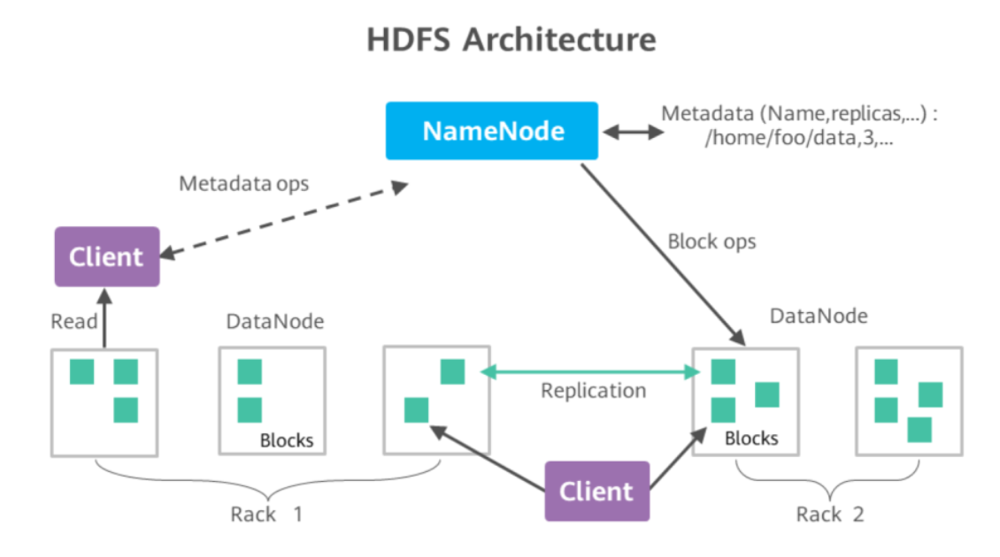
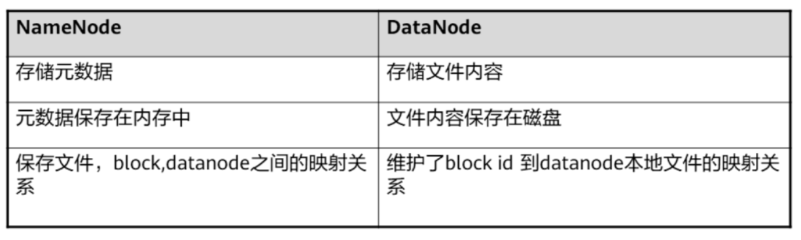
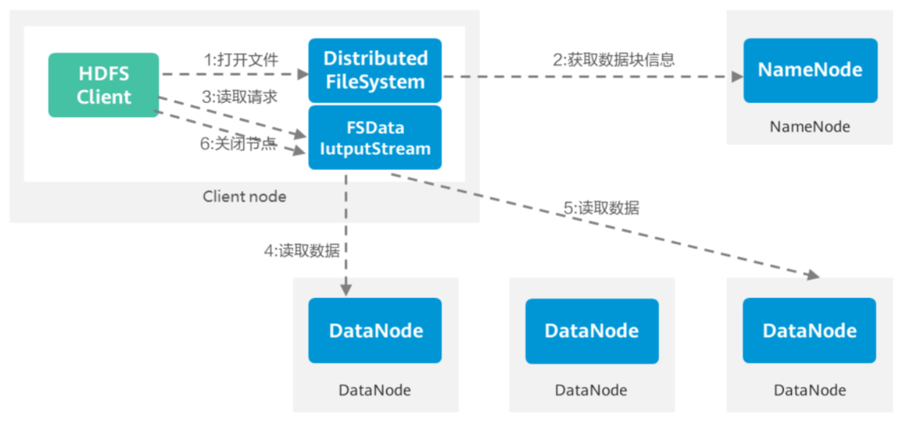
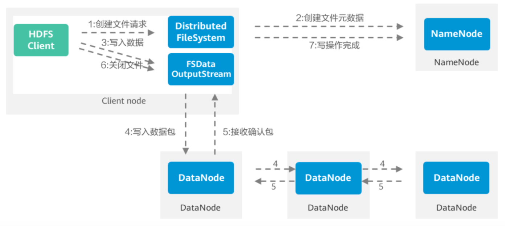

## hdfs
#### 特点与使用场景

#### 体系结构与基本概念

* NameNode 文件元数据
    * FsImage 用于维护文件系统树以及文件树中所有的文件和文件夹的元数据
    * EditLog 记录了所有针对文件的创建、删除、重命名等操作
* DataNode 存储数据，并向 NameNode 定期发送自己存储的块列表信息

#### hdfs 数据读流程

#### hdfs 数据写流程

#### hdfs 高可用
