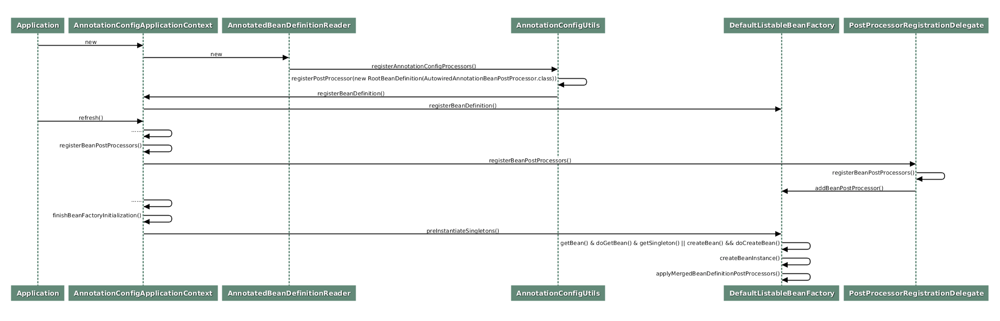

## Spring 生命周期常见错误
## 构造器内空指针异常
#### 示例
有如下示例：
```java
import org.springframework.beans.factory.annotation.Autowired;
import org.springframework.stereotype.Component;
@Component
public class LightMgrService {
  @Autowired
  private LightService lightService;
  public LightMgrService() {
    lightService.check(); // 1
  }
}
```
会在`1`处抛出空指针异常。

#### 分析
如下时序图描述了Spring启动的一些关键点：


图中主要包括三部分：
* 第一部分，将一些必要的系统类，比如 Bean 的后置处理器类，注册到 Spring 容器，其中就包括这里关注的 CommonAnnotationBeanPostProcessor 类；
* 第二部分，将这些后置处理器实例化，并注册到 Spring 的容器中；
* 第三部分，实例化所有用户定制类，调用后置处理器进行辅助装配、类初始化等等。

现在重点看下第三部分，即 Spring 初始化单例类的一般过程，基本都是`getBean()->doGetBean()->getSingleton()`，如果发现 Bean 不存在，则调用`createBean()->doCreateBean()`进行实例化。`doCreateBean()`的源代码如下：
```java

protected Object doCreateBean(final String beanName, final RootBeanDefinition mbd, final @Nullable Object[] args)
    throws BeanCreationException {
    //省略非关键代码
  if (instanceWrapper == null) {
    instanceWrapper = createBeanInstance(beanName, mbd, args); // 1
  }
  final Object bean = instanceWrapper.getWrappedInstance();

    //省略非关键代码
    Object exposedObject = bean;
    try {
       populateBean(beanName, mbd, instanceWrapper); // 2
       exposedObject = initializeBean(beanName, exposedObject, mbd); // 3
    }
    catch (Throwable ex) {
    //省略非关键代码
}
```

上述代码完整地展示了 Bean 初始化的三个关键步骤：
1. createBeanInstance
2. populateBean
3. initializeBean

分别对应**实例化 Bean，注入 Bean 依赖，以及初始化 Bean**（例如执行`@PostConstruct`标记的方法 ）这三个功能，这也和上述时序图的流程相符。

通过分析知道了问题的根源，就是在于使用 @Autowired 直接标记在成员属性上而引发的装配行为是发生在构造器执行之后的。

#### 解决方案
1. 使用构造器参数来隐式注入是一种 Spring 最佳实践
```java
@Component
public class LightMgrService {

    private LightService lightService;

    public LightMgrService(LightService lightService) {
        this.lightService = lightService;
        lightService.check();
    }
}
```

2. Spring 在类属性完成注入之后，会回调用户定制的初始化方法。即**在 populateBean 方法之后**，会调用 initializeBean 方法：
```java
protected Object initializeBean(final String beanName, final Object bean, @Nullable RootBeanDefinition mbd) {
   //省略非关键代码 
   if (mbd == null || !mbd.isSynthetic()) {
      wrappedBean = applyBeanPostProcessorsBeforeInitialization(wrappedBean, beanName);
   }
   try {
      invokeInitMethods(beanName, wrappedBean, mbd);
   }
   //省略非关键代码 
}
```

    可以看到 applyBeanPostProcessorsBeforeInitialization 和 invokeInitMethods 这两个关键方法的执行，它们分别处理了 @PostConstruct 注解和 InitializingBean 接口这两种不同的初始化方案的逻辑。
    因此，另外两种解决方案就很明显了：

```java
import org.springframework.beans.factory.annotation.Autowired;
import org.springframework.stereotype.Component;
@Component
public class LightMgrService {
  @Autowired
  private LightService lightService;
  
  @PostConstruct
  public void init() {
       lightService.check();
  }
}
```

```java
import org.springframework.beans.factory.InitializingBean;
import org.springframework.beans.factory.annotation.Autowired;
import org.springframework.stereotype.Component;
@Component
public class LightMgrService implements InitializingBean {
    @Autowired
    private LightService lightService;
  
    @Override
    public void afterPropertiesSet() throws Exception {
        lightService.check();
    }
}
```

> 上述过程可参考Spring官方文档及对应源码。

## 意外触发shutdown方法
#### 示例
在类销毁时也会有一些相对隐蔽的约定，导致一些难以察觉的错误。

沿用之前的场景，这里 LightService 包含了 shutdown 方法，负责关闭所有的灯，关键代码如下：
```java
import org.springframework.stereotype.Service;
@Service
public class LightService {
  //省略其他非关键代码
  public void shutdown(){
    System.out.println("shutting down all lights");
  }
  //省略其他非关键代码
}
```

但是随着业务的需求变化，可能会去掉 @Service 注解，而是使用另外一种产生 Bean 的方式：创建一个配置类 BeanConfiguration（标记  @Configuration）来创建一堆 Bean，其中就包含了创建 LightService 类型的 Bean，并将其注册到 Spring 容器：
```java
import org.springframework.context.annotation.Bean;
import org.springframework.context.annotation.Configuration;
@Configuration
public class BeanConfiguration {
    @Bean
    public LightService getTransmission(){
        return new LightService();
    }
}
```

让 Spring 启动完成后立马关闭当前 Spring 上下文。这样等同于模拟宿舍管理系统的启停：
```java
@SpringBootApplication
public class Application {
    public static void main(String[] args) {
        ConfigurableApplicationContext context = SpringApplication.run(Application.class, args);
        context.close();
    }
}
```

以上代码没有其他任何方法的调用，仅仅是将所有符合约定的类初始化并加载到 Spring 容器，完成后再关闭当前的 Spring 容器。按照预期，这段代码运行后不会有任何的 log 输出，毕竟我们只是改变了 Bean 的产生方式。

但实际运行这段代码后，可以看到控制台上打印了 "shutting down all lights"。显然 shutdown 方法未按照预期被执行了，这导致一个很有意思的 bug：在使用新的 Bean 生成方式之前，每一次宿舍管理服务被重启时，宿舍里所有的灯都不会被关闭。但是修改后，只要服务重启，灯都被意外关闭了。如何理解这个 bug?

#### 分析
通过调试发现**只有通过使用 @Bean 注解注册到 Spring 容器的对象，才会在 Spring 容器被关闭的时候自动调用 shutdown 方法**，而使用 @Component（Service 也是一种 Component）将当前类自动注入到 Spring 容器时，shutdown 方法则不会被自动执行。

我们可以尝试到 Bean 注解类的代码中去寻找一些线索，可以看到属性 destroyMethod 有非常大段的注释，基本上解答了我们对于这个问题的大部分疑惑。使用 Bean 注解的方法所注册的 Bean 对象，如果用户不设置 destroyMethod 属性，则其属性值为 AbstractBeanDefinition.INFER_METHOD。此时 Spring 会检查当前 Bean 对象的原始类中是否有名为 shutdown 或者 close 的方法，如果有，此方法会被 Spring 记录下来，并在容器被销毁时自动执行；当然如若没有，那么自然什么都不会发生。


接下来查看 Spring 的源代码来进一步分析此问题。首先我们可以查找 INFER_METHOD 枚举值的引用，很容易就找到了使用该枚举值的方法 DisposableBeanAdapter#inferDestroyMethodIfNecessary：
```java
private String inferDestroyMethodIfNecessary(Object bean, RootBeanDefinition beanDefinition) {
   String destroyMethodName = beanDefinition.getDestroyMethodName();
   if (AbstractBeanDefinition.INFER_METHOD.equals(destroyMethodName) ||(destroyMethodName == null && bean instanceof AutoCloseable)) {
      if (!(bean instanceof DisposableBean)) {
         try {
            //尝试查找 close 方法
            return bean.getClass().getMethod(CLOSE_METHOD_NAME).getName();
         }
         catch (NoSuchMethodException ex) {
            try {
               //尝试查找 shutdown 方法
               return bean.getClass().getMethod(SHUTDOWN_METHOD_NAME).getName();
            }
            catch (NoSuchMethodException ex2) {
               // no candidate destroy method found
            }
         }
      }
      return null;
   }
   return (StringUtils.hasLength(destroyMethodName) ? destroyMethodName : null);
}
```


#### 解决方案


***
> 示例->分析->解决方案