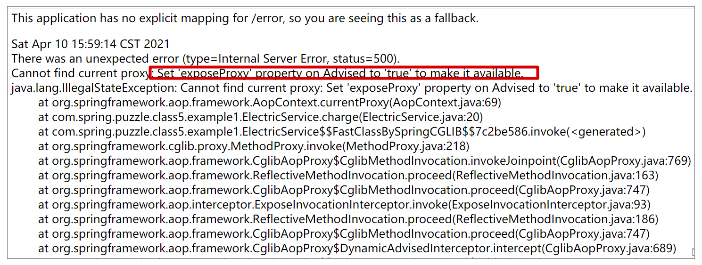

# Spring AOP 常见错误
Spring AOP 是 Spring 中除了依赖注入外（DI）最为核心的功能。顾名思义，AOP 即 Aspect Oriented Programming，面向切面编程。

Spring AOP 则利用 CGlib 和 JDK 动态代理等方式来实现运行期动态方法增强，其目的是将与业务无关的代码单独抽离出来，使其逻辑不再与业务代码耦合，从而降低系统的耦合性，提高程序的可重用性和开发效率。因而 AOP 便成为了日志记录、监控管理、性能统计、异常处理、权限管理、统一认证等各个方面被广泛使用的技术。

追根溯源，我们之所以能无感知地在容器对象方法前后任意添加代码片段，那是由于 Spring 在运行期帮我们把切面中的代码逻辑动态“织入”到了容器对象方法内，所以说 AOP 本质上就是一个代理模式。然而在使用这种代理模式时，常常会用不好，那么这里就来解析下有哪些常见的问题，以及背后的原理是什么。

## this 调用当前类方法无法被拦截
#### 实例
假设正在开发一个宿舍管理系统，这个模块包含一个负责电费充值的类 ElectricService，它含有一个充电方法 charge()：
```java
@Service
public class ElectricService {

    public void charge() throws Exception {
        System.out.println("Electric charging ...");
        this.pay();
    }

    public void pay() throws Exception {
        System.out.println("Pay with alipay ...");
        Thread.sleep(1000);
    }

}
```

在这个电费充值方法 charge() 中会使用支付宝进行充值。因此在这个方法中加入了 pay() 方法。为了模拟 pay() 方法调用耗时，代码执行了休眠 1 秒，并在 charge() 方法里使用 this.pay() 的方式调用这种支付方法。但是因为支付宝支付是第三方接口，我们需要记录下接口调用时间。这时候我们就引入了一个 @Around 的增强 ，分别记录在 pay() 方法执行前后的时间，并计算出执行 pay() 方法的耗时。
```java
@Aspect
@Service
@Slf4j
public class AopConfig {
    @Around("execution(* com.spring.puzzle.class5.example1.ElectricService.pay()) ")
    public void recordPayPerformance(ProceedingJoinPoint joinPoint) throws Throwable {
        long start = System.currentTimeMillis();
        joinPoint.proceed();
        long end = System.currentTimeMillis();
        System.out.println("Pay method time cost（ms）: " + (end - start));
    }
}
```

最后再通过定义一个 Controller 来提供电费充值接口，定义如下：
```java
@RestController
public class HelloWorldController {
    @Autowired
    ElectricService electricService;
    @RequestMapping(path = "charge", method = RequestMethod.GET)
    public void charge() throws Exception{
          electricService.charge();
    };
}
```

完成代码后，访问上述接口，会发现这段计算时间的切面并没有执行到，输出日志如下：
```
Electric charging ...
Pay with alipay ...
```

回溯之前的代码可知，在 @Around 的切面类中很清晰地定义了切面对应的方法，但是却没有被执行到。这说明了在类的内部，通过 this 方式调用的方法，是没有被 Spring AOP 增强的。这是为什么呢？我们来分析一下。

#### 分析
**只有引用的是被动态代理创建出来的对象**，才会被 Spring 增强，具备 AOP 该有的功能。

#### 解决方案
1. 最简单的解决方案，自己注入自己：
```java
@Service
public class ElectricService {
    @Autowired
    ElectricService electricService;
    public void charge() throws Exception {
        System.out.println("Electric charging ...");
        //this.pay();
        electricService.pay();
    }
    public void pay() throws Exception {
        System.out.println("Pay with alipay ...");
        Thread.sleep(1000);
    }
}
```
2. 另一种方法就是直接从 AopContext 获取当前的 Proxy。AopContext 的核心就是通过一个 ThreadLocal 来将 Proxy 和线程绑定起来，这样就可以随时拿出当前线程绑定的 Proxy。不过使用这种方法有个小前提，就是需要在 @EnableAspectJAutoProxy 里加一个配置项 exposeProxy = true，表示将代理对象放入到 ThreadLocal，这样才可以直接通过 AopContext.currentProxy() 的方式获取到，否则会报错如下：


    按这个思路，更改代码如下：
```java
import org.springframework.aop.framework.AopContext;
import org.springframework.stereotype.Service;
@Service
public class ElectricService {
    public void charge() throws Exception {
        System.out.println("Electric charging ...");
        ElectricService electric = ((ElectricService) AopContext.currentProxy());
        electric.pay();
    }
    public void pay() throws Exception {
        System.out.println("Pay with alipay ...");
        Thread.sleep(1000);
    }
}
```
    同时，修改 EnableAspectJAutoProxy 注解的 exposeProxy 属性示例如下：
```java
@SpringBootApplication
@EnableAspectJAutoProxy(exposeProxy = true)
public class Application {
    // 省略非关键代码
}
```

## 直接访问被拦截类的属性抛空指针异常
接着上一个案例，在宿舍管理系统中，我们使用了 charge() 方法进行支付。在统一结算的时候会用到一个管理员用户付款编号，这时候就用到了几个新的类。User 类，包含用户的付款编号信息：
```java
public class User {
    private String payNum;
    public User(String payNum) {
        this.payNum = payNum;
    }
    public String getPayNum() {
        return payNum;
    }
    public void setPayNum(String payNum) {
        this.payNum = payNum;
    }
}
```

AdminUserService 类，包含一个管理员用户（User），其付款编号为 202101166；另外，这个服务类有一个 login() 方法，用来登录系统。
```java
@Service
public class AdminUserService {
    public final User adminUser = new User("202101166");
    
    public void login() {
        System.out.println("admin user login...");
    }
}
```

我们需要修改 ElectricService 类实现这个需求：在电费充值时，需要管理员登录并使用其编号进行结算。完整代码如下：
```java
import org.springframework.beans.factory.annotation.Autowired;
import org.springframework.stereotype.Service;
@Service
public class ElectricService {
    @Autowired
    private AdminUserService adminUserService;
    public void charge() throws Exception {
        System.out.println("Electric charging ...");
        this.pay();
    }

    public void pay() throws Exception {
        adminUserService.login();
        String payNum = adminUserService.adminUser.getPayNum();
        System.out.println("User pay num : " + payNum);
        System.out.println("Pay with alipay ...");
        Thread.sleep(1000);
    }
}
```

代码完成后，执行 charge() 操作，一切正常：
```
Electric charging ...
admin user login...
User pay num : 202101166
Pay with alipay ...
```

这时候，由于安全需要，就需要管理员在登录时，记录一行日志以便于以后审计管理员操作。所以我们添加一个 AOP 相关配置类，具体如下：
```java
@Aspect
@Service
@Slf4j
public class AopConfig {
    @Before("execution(* com.spring.puzzle.class5.example2.AdminUserService.login(..)) ")
    public void logAdminLogin(JoinPoint pjp) throws Throwable {
        System.out.println("! admin login ...");
    }
}
```

添加这段代码后，我们执行 charge() 操作，发现不仅没有相关日志，而且在执行下面这一行代码的时候直接抛出了 NullPointerException：
```java
String payNum = dminUserService.user.getPayNum();
```

#### 分析
正常情况下，AdminUserService 只是一个普通的对象，而 AOP 增强过的则是一个 AdminUserService $$EnhancerBySpringCGLIB$$xxxx。**这个类实际上是 AdminUserService 的一个子类**，它会 overwrite 所有 public 和 protected 方法，并在内部将调用委托给原始的 AdminUserService 实例。

从具体实现角度看，CGLIB 中 AOP 的实现是基于 org.springframework.cglib.proxy 包中  Enhancer 和 MethodInterceptor 两个接口来实现的。

Spring 会默认尝试使用 objenesis 方式实例化对象，如果失败则再次尝试使用常规方式实例化对象。objenesis 方式最后使用了 JDK 的 ReflectionFactory.newConstructorForSerialization() 完成了**代理对象的实例化**。而**这种方式创建出来的对象不会初始化类成员变量**。

#### 解决方案
既然是无法直接访问被拦截类的成员变量，那就换个方式，在 UserService 里写个 getUser() 方法，从内部访问获取变量。我们在 AdminUserService 里加了个 getUser() 方法：
```java
public User getUser() {
    return user;
}
```

在 ElectricService 里通过 getUser() 获取 User 对象：
```java
// 原来出错的方式：
//String payNum = = adminUserService.adminUser.getPayNum();
// 修改后的方式：
String payNum = adminUserService.getAdminUser().getPayNum();
```

运行下来，一切正常，可以看到管理员登录日志了。

但有没有产生另一个困惑呢？既然代理类的类属性不会被初始化，那为什么可以通过在 AdminUserService 里写个 getUser() 方法来获取代理类实例的属性呢？

再次回顾 createProxyClassAndInstance 的代码逻辑，创建代理类后，我们会调用 setCallbacks 来设置拦截后需要注入的代码：
```java
protected Object createProxyClassAndInstance(Enhancer enhancer, Callback[] callbacks) {
   Class<?> proxyClass = enhancer.createClass();
   Object proxyInstance = null;
   if (objenesis.isWorthTrying()) {
      try {
         proxyInstance = objenesis.newInstance(proxyClass, enhancer.getUseCache());
      }
   // 省略非关键代码
   ((Factory) proxyInstance).setCallbacks(callbacks);
   return proxyInstance;
}
```

通过代码调试和分析，我们可以得知上述的 callbacks 中会存在一种服务于 AOP 的 DynamicAdvisedInterceptor，它的接口是 MethodInterceptor（callback 的子接口），实现了拦截方法 intercept()。我们可以看下它是如何实现这个方法的：
```java
public Object intercept(Object proxy, Method method, Object[] args, MethodProxy methodProxy) throws Throwable {
   // 省略非关键代码
    TargetSource targetSource = this.advised.getTargetSource();
    // 省略非关键代码 
      if (chain.isEmpty() && Modifier.isPublic(method.getModifiers())) {
         Object[] argsToUse = AopProxyUtils.adaptArgumentsIfNecessary(method, args);
         retVal = methodProxy.invoke(target, argsToUse);
      }
      else {
         // We need to create a method invocation...
         retVal = new CglibMethodInvocation(proxy, target, method, args, targetClass, chain, methodProxy).proceed();
      }
      retVal = processReturnType(proxy, target, method, retVal);
      return retVal;
   }
   //省略非关键代码
}
```

当代理类方法被调用，会被 Spring 拦截，从而进入此 intercept()，并在此方法中获取被代理的原始对象。而在原始对象中，类属性是被实例化过且存在的。因此代理类是可以通过方法拦截获取被代理对象实例的属性。

> 当一个系统采用的切面越来越多时，因为执行顺序而导致的问题便会逐步暴露出来，下面我们就重点看一下。

<!-- ## 错乱混合不同类型的增强
#### 示例


#### 分析

#### 解决方案

***
## XXX
#### 示例

#### 分析

#### 解决方案 -->
